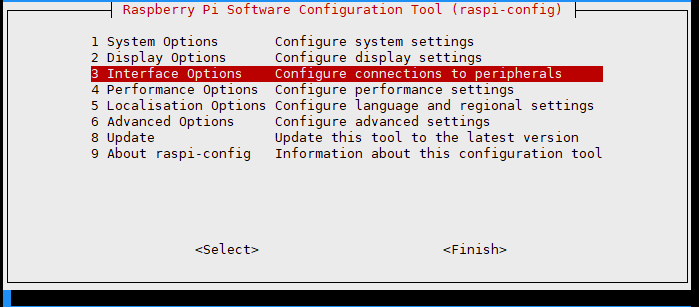
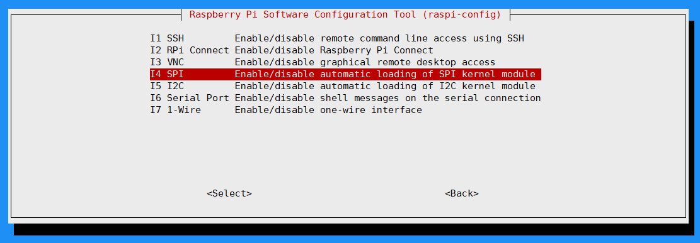
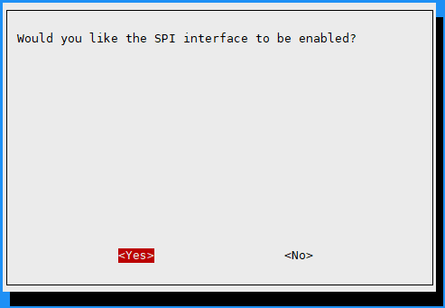
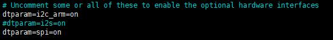

.. _raspberrypi:

Raspberry Pi User Guide
=======================

Hardware Connection
-------------------

Insert the e-Paper HAT directly into the Raspberry Pi 40-pin GPIO header, and make sure all pins are aligned correctly before powering on.

.. .. image:: img/rpi_pin.jpg

.. .. image:: img/rpi_zero_pin.png

Enable SPI Interface
--------------------

Open the Raspberry Pi terminal and run the following command:

.. code-block:: bash

    sudo raspi-config
    # Select Interfacing Options -> SPI -> Yes to enable the SPI interface

Then restart your Raspberry Pi:

.. code-block:: bash

    sudo reboot now

Check ``/boot/config.txt`` or ``/boot/firmware/config.txt`` to confirm that SPI is enabled:

.. code-block:: bash

    sudo cat /boot/config.txt
    # Or for newer systems
    sudo cat /boot/firmware/config.txt

Choose a demo language:

* :ref:`raspberrypi_c`
* :ref:`raspberrypi_python`

.. _raspberrypi_c:

C Language
----------

Install lg Library
^^^^^^^^^^^^^^^^^^

Open the Raspberry Pi terminal and run the following commands:

.. code-block:: bash

    wget https://github.com/joan2937/lg/archive/master.zip
    unzip master.zip
    cd lg-master
    make
    sudo make install

For more details, refer to the source code: https://github.com/gpiozero/lg

On Raspberry Pi OS, installing the ``lg`` library is usually enough to run the C demo.
If the demo fails to compile or run, install the additional libraries below as needed.

Install gpiod Library If Needed
^^^^^^^^^^^^^^^^^^^^^^^^^^^^^^^

Open the Raspberry Pi terminal and run the following commands:

.. code-block:: bash

    sudo apt-get update
    sudo apt install gpiod libgpiod-dev

Install BCM2835 If Needed
^^^^^^^^^^^^^^^^^^^^^^^^^

Open the Raspberry Pi terminal and run the following commands:

.. code-block:: bash

    wget http://www.airspayce.com/mikem/bcm2835/bcm2835-1.71.tar.gz
    tar zxvf bcm2835-1.71.tar.gz
    cd bcm2835-1.71/
    sudo ./configure && sudo make && sudo make check && sudo make install

For more information, refer to the official website: http://www.airspayce.com/mikem/bcm2835/

Install WiringPi If Needed
^^^^^^^^^^^^^^^^^^^^^^^^^^

Open the Raspberry Pi terminal and run the following command:

.. code-block:: bash

    sudo apt-get install wiringpi

For Raspberry Pi systems released after May 2019, you may need to upgrade WiringPi. Earlier systems may not require this step.

.. code-block:: bash

    wget https://project-downloads.drogon.net/wiringpi-latest.deb
    sudo dpkg -i wiringpi-latest.deb
    gpio -v

Running ``gpio -v`` should display version 2.52. If it does not, the installation was not successful.

For Bullseye systems, use the following commands instead:

.. code-block:: bash

    git clone https://github.com/WiringPi/WiringPi
    cd WiringPi
    ./build
    gpio -v

Running ``gpio -v`` should display version 2.60. If it does not, the installation was not successful.

Download Demo Code
^^^^^^^^^^^^^^^^^^

If you have already downloaded the code, you can skip this step.

.. code-block:: bash

    git clone https://github.com/lafvintech/LAFVIN-2.13inch-ePaper-HAT.git
    cd LAFVIN-2.13inch-ePaper-HAT/RaspberryPi

Compile the Demo Program
^^^^^^^^^^^^^^^^^^^^^^^^

.. note::
    On Raspberry Pi OS, try compiling after installing only the ``lg`` library first.
    If you encounter missing dependency errors, return to the optional library steps above and install the required packages.
    ``-j4`` uses 4 threads for compilation, and you can adjust the number as needed.
    ``EPD=epd2in13V4`` specifies the macro definition used by the test demo in the main function.

.. code-block:: bash

    cd c
    sudo make clean
    sudo make -j4 EPD=epd2in13V4

Run the Demo Program
^^^^^^^^^^^^^^^^^^^^

.. code-block:: bash

    sudo ./epd

.. _raspberrypi_python:

Python
------

Install Libraries for Python 3
^^^^^^^^^^^^^^^^^^^^^^^^^^^^^^

.. code-block:: bash

    sudo apt-get update
    sudo apt-get install python3-pip
    sudo apt-get install python3-pil
    sudo apt-get install python3-numpy

If you encounter a ``spidev``-related error while running the demo, install it with:

.. code-block:: bash

    sudo pip3 install spidev

You can continue without installing it first. If an error occurs during execution, install it at that time.

Install Libraries for Python 2
^^^^^^^^^^^^^^^^^^^^^^^^^^^^^^

.. code-block:: bash

    sudo apt-get update
    sudo apt-get install python-pip
    sudo apt-get install python-pil
    sudo apt-get install python-numpy

If you encounter a ``spidev``-related error while running the demo, install it with:

.. code-block:: bash

    sudo pip install spidev

You can continue without installing it first. If an error occurs during execution, install it at that time.

Install gpiozero Library
^^^^^^^^^^^^^^^^^^^^^^^^

.. note::
    This library is installed by default on most systems. If it is missing, install it with the following commands:

.. code-block:: bash

    sudo apt-get update
    # Python 3
    sudo apt install python3-gpiozero
    # Python 2
    sudo apt install python-gpiozero

Download Demo Code
^^^^^^^^^^^^^^^^^^

If you have already downloaded the code, you can skip this step.

.. code-block:: bash

    git clone https://github.com/lafvintech/LAFVIN-2.13inch-ePaper-HAT.git
    cd LAFVIN-2.13inch-ePaper-HAT/RaspberryPi/python/examples

Run the Demo Program
^^^^^^^^^^^^^^^^^^^^

.. code-block:: bash

    sudo python3 epd_2in13_V4_test.py

.. _unzip_code:

.. note::
    If you cannot download the code from GitHub, you can use the following commands to download the ZIP file and extract it. The remaining steps are the same as above.

    .. code-block:: bash

        wget https://github.com/lafvintech/LAFVIN-2.13inch-ePaper-HAT/archive/refs/heads/main.zip
        unzip main.zip
        cd LAFVIN-2.13inch-ePaper-HAT-main

    Replace the path ``LAFVIN-2.13inch-ePaper-HAT`` with ``LAFVIN-2.13inch-ePaper-HAT-main`` in the commands that follow.
