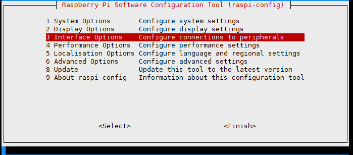
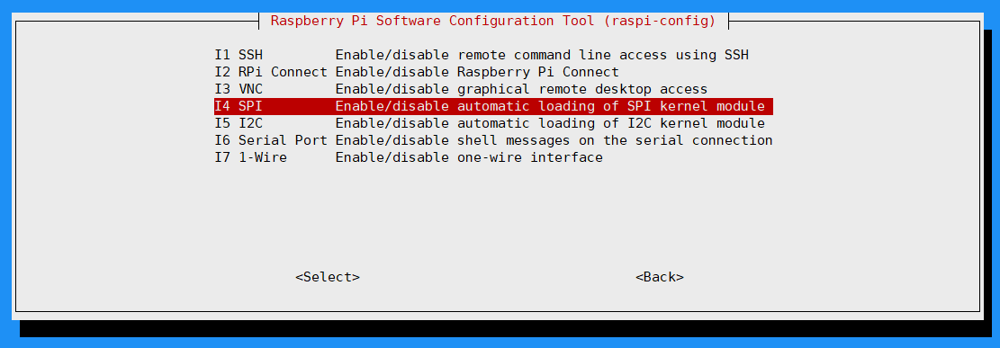
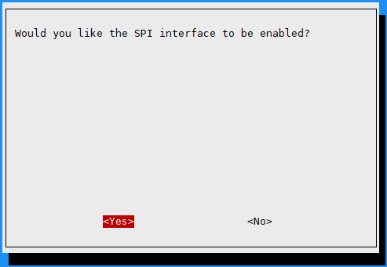
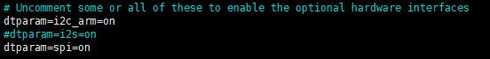

.. _raspberrypi:

Raspberry Pi User Guide
=======================

Hardware Connection
-------------------

Insert the LAFVIN 2.9 inch E-paper Module directly into the Raspberry Pi
40-pin GPIO header, and make sure all pins are aligned correctly before
powering on.

.. list-table:: Raspberry Pi Pin Correspondence Table
   :header-rows: 1
   :widths: 30 45 25
   :class: longtable

   * - E-paper module pin
     - Raspberry Pi signal
     - Physical pin
   * - VCC
     - 3.3V
     - Pin 1
   * - GND
     - GND
     - Pin 6
   * - DIN / MOSI
     - GPIO10
     - Pin 19
   * - CLK / SCK
     - GPIO11
     - Pin 23
   * - CS
     - GPIO8
     - Pin 24
   * - DC
     - GPIO25
     - Pin 22
   * - RST
     - GPIO17
     - Pin 11
   * - BUSY
     - GPIO24
     - Pin 18

.. .. image:: img/rpi_pin.jpg

.. .. image:: img/rpi_zero_pin.png

Enable SPI Interface
--------------------

Open the Raspberry Pi terminal and run the following command:

.. code-block:: bash

    sudo raspi-config
    # Select Interfacing Options -> SPI -> Yes to enable the SPI interface

Then restart your Raspberry Pi:

.. code-block:: bash

    sudo reboot now

Check ``/boot/config.txt`` or ``/boot/firmware/config.txt`` to confirm that SPI is enabled:

.. code-block:: bash

    sudo cat /boot/config.txt
    # Or for newer systems
    sudo cat /boot/firmware/config.txt

Choose a demo language:

* :ref:`raspberrypi_c`
* :ref:`raspberrypi_python`

.. _raspberrypi_c:

C Language
----------

.. note::
    On the latest Raspberry Pi OS, the tested C demo only requires the ``lg``
    library. The other GPIO libraries below are optional; install them only
    if your demo configuration requires them.

Install lg Library (Required)
^^^^^^^^^^^^^^^^^^^^^^^^^^^^^^^^^^^^^^^^

Open the Raspberry Pi terminal and run the following commands:

.. code-block:: bash

    wget https://github.com/joan2937/lg/archive/master.zip
    unzip master.zip
    cd lg-master
    make
    sudo make install

For more details, refer to the source code: https://github.com/gpiozero/lg

Optional GPIO Libraries
^^^^^^^^^^^^^^^^^^^^^^^

Skip these installations for the tested ``lg`` demo on the latest
Raspberry Pi OS. Expand a section only if your demo configuration requires
that library.

.. raw:: html

    

    
Install gpiod Library (Optional)

Open the Raspberry Pi terminal and run the following commands:

.. code-block:: bash

    sudo apt-get update
    sudo apt install gpiod libgpiod-dev

.. raw:: html

    

.. raw:: html

    

    
Install BCM2835 (Optional)

Open the Raspberry Pi terminal and run the following commands:

.. code-block:: bash

    wget http://www.airspayce.com/mikem/bcm2835/bcm2835-1.71.tar.gz
    tar zxvf bcm2835-1.71.tar.gz
    cd bcm2835-1.71/
    sudo ./configure && sudo make && sudo make check && sudo make install

For more information, refer to the official website: http://www.airspayce.com/mikem/bcm2835/

.. raw:: html

    

.. raw:: html

    

    
Install WiringPi (Optional)

Open the Raspberry Pi terminal and run the following command:

.. code-block:: bash

    sudo apt-get install wiringpi

For Raspberry Pi systems released after May 2019, you may need to upgrade WiringPi. Earlier systems may not require this step.

.. code-block:: bash

    wget https://project-downloads.drogon.net/wiringpi-latest.deb
    sudo dpkg -i wiringpi-latest.deb
    gpio -v

Running ``gpio -v`` should display version 2.52. If it does not, the installation was not successful.

For Bullseye systems, use the following commands instead:

.. code-block:: bash

    git clone https://github.com/WiringPi/WiringPi
    cd WiringPi
    ./build
    gpio -v

Running ``gpio -v`` should display version 2.60. If it does not, the installation was not successful.

.. raw:: html

    

Download Demo Code
^^^^^^^^^^^^^^^^^^

If you have already downloaded the code, you can skip this step.

.. code-block:: bash

    git clone https://github.com/lafvintech/LAFVIN-2.9inch-ePaper-HAT.git
    cd LAFVIN-2.9inch-ePaper-HAT/RPI

.. _unzip_code:

.. note::
    If you cannot download the code from GitHub, you can use the following commands to download the ZIP file and extract it. The remaining steps are the same as above.

    .. code-block:: bash

        wget https://github.com/lafvintech/LAFVIN-2.9inch-ePaper-HAT/archive/refs/heads/main.zip
        unzip main.zip
        cd LAFVIN-2.9inch-ePaper-HAT-main/RPI

    Replace the path ``LAFVIN-2.9inch-ePaper-HAT`` with ``LAFVIN-2.9inch-ePaper-HAT-main`` in the commands that follow.

Compile the Demo Program
^^^^^^^^^^^^^^^^^^^^^^^^

.. note::
    On the latest Raspberry Pi OS, install only the ``lg`` library before
    compiling the tested C demo. The other GPIO libraries are optional and
    are needed only if your demo is configured to use them.
    ``-j4`` uses 4 threads for compilation, and you can adjust the number as needed.

.. code-block:: bash

    cd c
    sudo make clean
    sudo make -j4

Run the Demo Program
^^^^^^^^^^^^^^^^^^^^

.. code-block:: bash

    sudo ./epd

.. _raspberrypi_python:

Python
------

Use Python 3
^^^^^^^^^^^^^^^^^^^^^^^^^^^^^^^^^^^^^^^^

This example requires Python 3 (3.8 or later). Use the system ``python3``
interpreter to run it.

.. note::
    In our tested Raspberry Pi OS setup, the Python demo runs without any
    additional library installation. Pillow and the Python ``lgpio`` module
    are already available. Try running the demo first; use the collapsed
    installation instructions below only if a missing-library error appears.

Download Demo Code
^^^^^^^^^^^^^^^^^^^^^^^^^^^^^^^^^^^^^^^^

If you have already downloaded the code, you can skip this step and open
``RPI/python/examples`` in the extracted project folder.

.. code-block:: bash

    git clone https://github.com/lafvintech/LAFVIN-2.9inch-ePaper-HAT.git
    cd LAFVIN-2.9inch-ePaper-HAT/RPI/python/examples

Run the Demo Program
^^^^^^^^^^^^^^^^^^^^^^^^^^^^^^^^^^^^^^^^

.. code-block:: bash

    sudo python3 epd_2in9g_test.py

The example loads the project driver directly from ``RPI/python/lib``;
installing the project as a Python package is not required.

Install Missing Libraries
^^^^^^^^^^^^^^^^^^^^^^^^^^^^^^^^^^^^^^^^

Pillow handles images, drawing, and fonts. The Python ``lgpio`` module
handles GPIO and SPI. Install only the library reported as missing, then
run the demo command above again.

.. raw:: html

    

    
Install Pillow If Missing

If the demo reports ``ModuleNotFoundError: No module named 'PIL'``, install
Pillow for the system Python 3 interpreter:

.. code-block:: bash

    sudo apt update
    sudo apt install python3-pil

Confirm that Pillow can be imported:

.. code-block:: bash

    sudo python3 -c "from PIL import Image, ImageDraw, ImageFont; print('Pillow is available')"

.. raw:: html

    

.. raw:: html

    

    
Install Python lgpio If Missing

If the demo reports ``Cannot import lgpio`` or
``ModuleNotFoundError: No module named 'lgpio'``, install the Python binding:

.. code-block:: bash

    sudo apt update
    sudo apt install python3-lgpio

Confirm that lgpio can be imported:

.. code-block:: bash

    sudo python3 -c "import lgpio; print('lgpio is available')"

.. raw:: html

    

