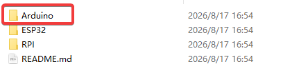
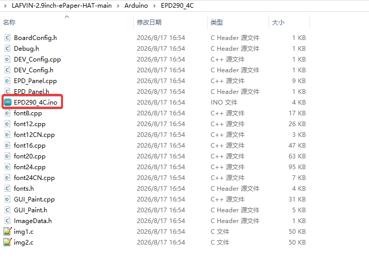
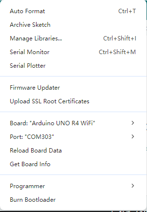
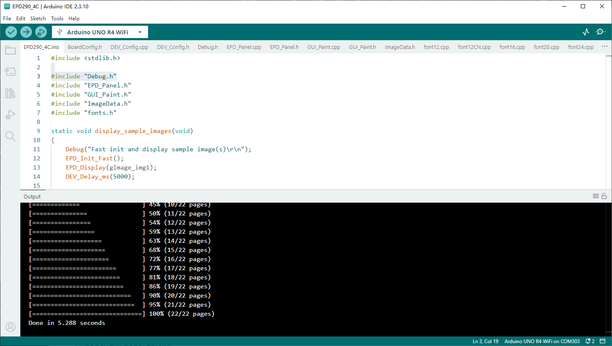
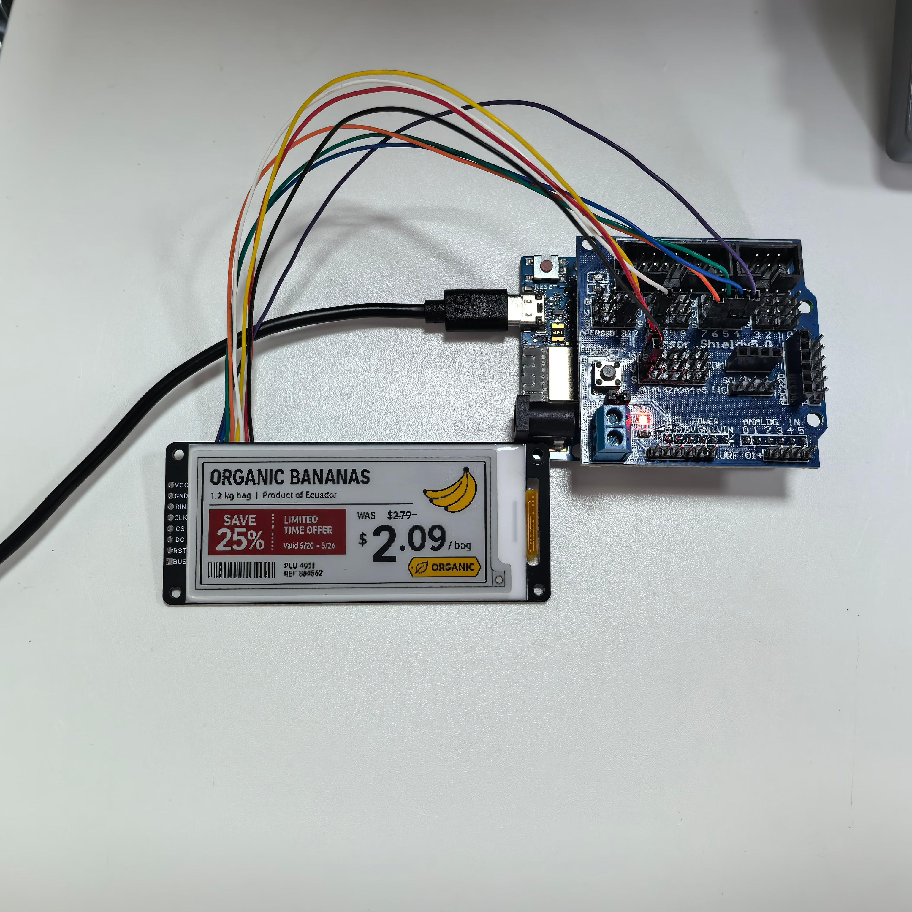

.. _arduino:

Arduino UNO R4
==============

Use an **Arduino UNO R4** to run this example.

Hardware Connection
-------------------

Use an 8PIN cable to connect. Link according to the table below.

.. list-table:: Arduino UNO R4 Wiring
   :header-rows: 1
   :widths: 40 60
   :class: longtable

   * - E-paper module pin
     - Arduino UNO R4 pin
   * - VCC
     - VCC_INT (module 5 V supply)
   * - GND
     - GND
   * - DIN / MOSI
     - D11
   * - CLK / SCK
     - D13
   * - CS
     - D7
   * - DC
     - D6
   * - RST
     - D5
   * - BUSY
     - D4

The module regulates the supply internally and level-translates the host
signals. The reference driver sets the SPI frequency to 4 MHz.

Install Arduino IDE
---------------------

You can refer to this tutorial to install Arduino IDE:

:ref:`install_arduino_ide` 

Run The Demo
--------------

Download the code by clicking this link: `Download Code <https://codeload.github.com/lafvintech/LAFVIN-2.9inch-ePaper-HAT/zip/refs/heads/main>`_

After downloading and extracting the files, navigate to the Arduino folder where you'll find the example programs:

   
   *Arduino Example Folder*

Open the EPD290_4C.ino file:

   
   *Opening the Example File*

In the Arduino IDE **Tools** menu, select the **Arduino UNO R4** model that
matches your board and its connected port. The screenshot below selects
**Arduino UNO R4 WiFi**:

   
   *Selecting the Arduino UNO R4 Board and Port*

Finally, click upload. A successful upload will look like this (Arduino 2.3.10):

   
   *Successful Upload*

After uploading, you will see the example program patterns displayed on your e-Paper screen.

.. raw:: html

   
