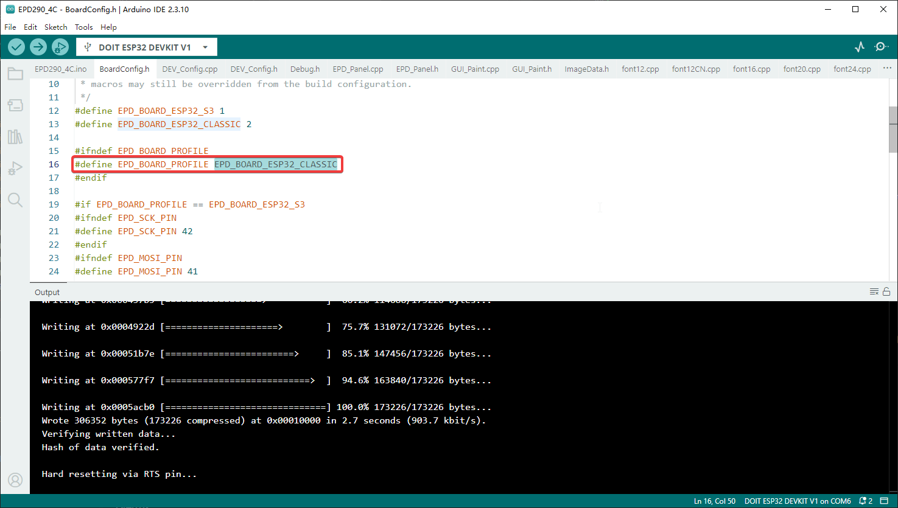
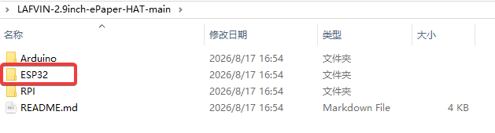
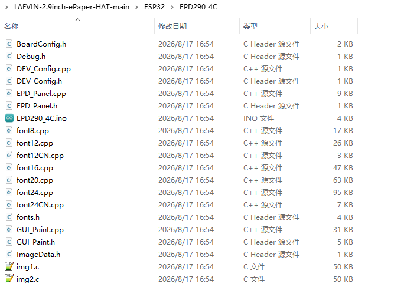
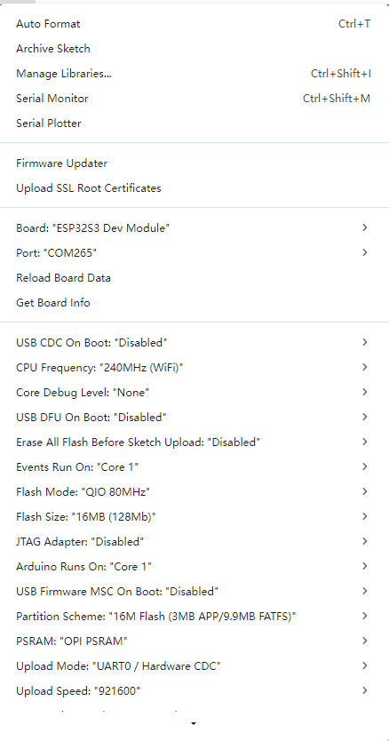
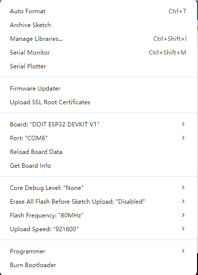
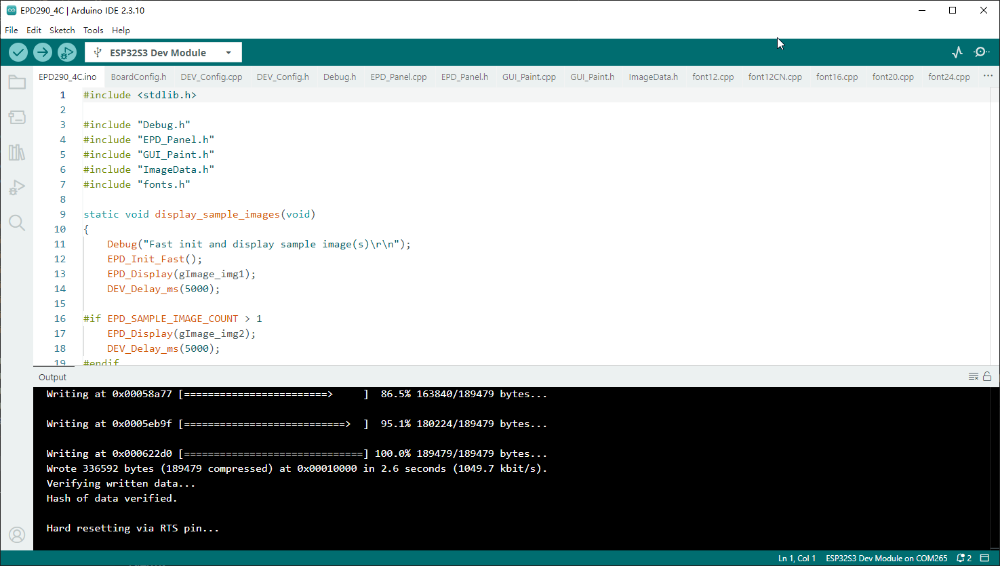

ESP32
=====

Software Setup
--------------

Before using this example, complete :ref:`install_esp32_board_package`.
The setup guide covers Arduino IDE installation, the Espressif ESP32 board
package, and board and port selection for ESP32 and ESP32-S3.
If the package is already installed, continue with the hardware connection below.

Hardware Connection
-------------------

Use the module's 8-pin header. The examples provide a default
ESP32-S3 profile and an alternate classic ESP32 profile. 
Link according to the table below.

ESP32-S3 (default)
^^^^^^^^^^^^^^^^^^^

.. list-table:: ESP32-S3 Pin Correspondence Table
   :header-rows: 1
   :widths: 45 55
   :class: longtable

   * - E-paper module pin
     - ESP32-S3 GPIO
   * - VCC
     - 3.3V
   * - GND
     - GND
   * - DIN / MOSI
     - GPIO41
   * - CLK / SCK
     - GPIO42
   * - CS
     - GPIO4
   * - DC
     - GPIO5
   * - RST
     - GPIO35
   * - BUSY
     - GPIO36

Classic ESP32
^^^^^^^^^^^^^

.. list-table:: Classic ESP32 Pin Correspondence Table
   :header-rows: 1
   :widths: 45 55
   :class: longtable

   * - E-paper module pin
     - ESP32 GPIO
   * - VCC
     - 3.3V
   * - GND
     - GND
   * - DIN / MOSI
     - GPIO2
   * - CLK / SCK
     - GPIO4
   * - CS
     - GPIO5
   * - DC
     - GPIO18
   * - RST
     - GPIO19
   * - BUSY
     - GPIO21

For classic ESP32, select ``EPD_BOARD_ESP32_CLASSIC`` instead of the default
``EPD_BOARD_ESP32_S3`` profile in the matching LAFVIN-EPD board configuration.

The module regulates the supply internally and level-translates the host
signals. The reference driver sets the SPI frequency to 4 MHz.

Run The Demo
--------------

Download the code by clicking this link: `Download Code <https://codeload.github.com/lafvintech/LAFVIN-2.9inch-ePaper-HAT/zip/refs/heads/main>`_

`Code Download <https://github.com/lafvintech/LAFVIN-2.9inch-ePaper-HAT/archive/refs/heads/main.zip>`_

After downloading and extracting the files, navigate to the ESP32/EPD290_4C folder where you'll find the example programs:

   
   *Arduino Example Folder*

Open the EPD290_4C.ino file:

   
   *Opening the Example File*

Select the corresponding Board and Port in the Tools menu of the Arduino IDE:

   
   *Esp32s3 Selecting Board and Port*

   
   *Esp32 Selecting Board and Port*

Finally, click upload. A successful upload will look like this (Arduino 2.3.10):

   
   *Successful Upload*
