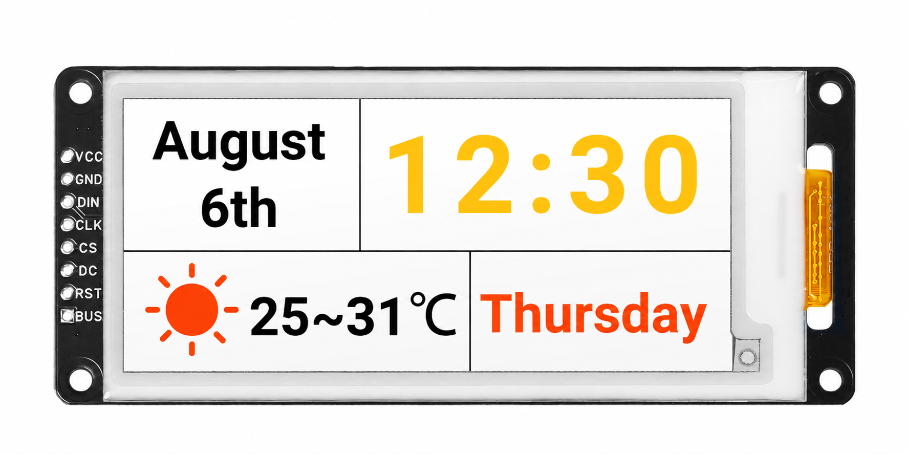
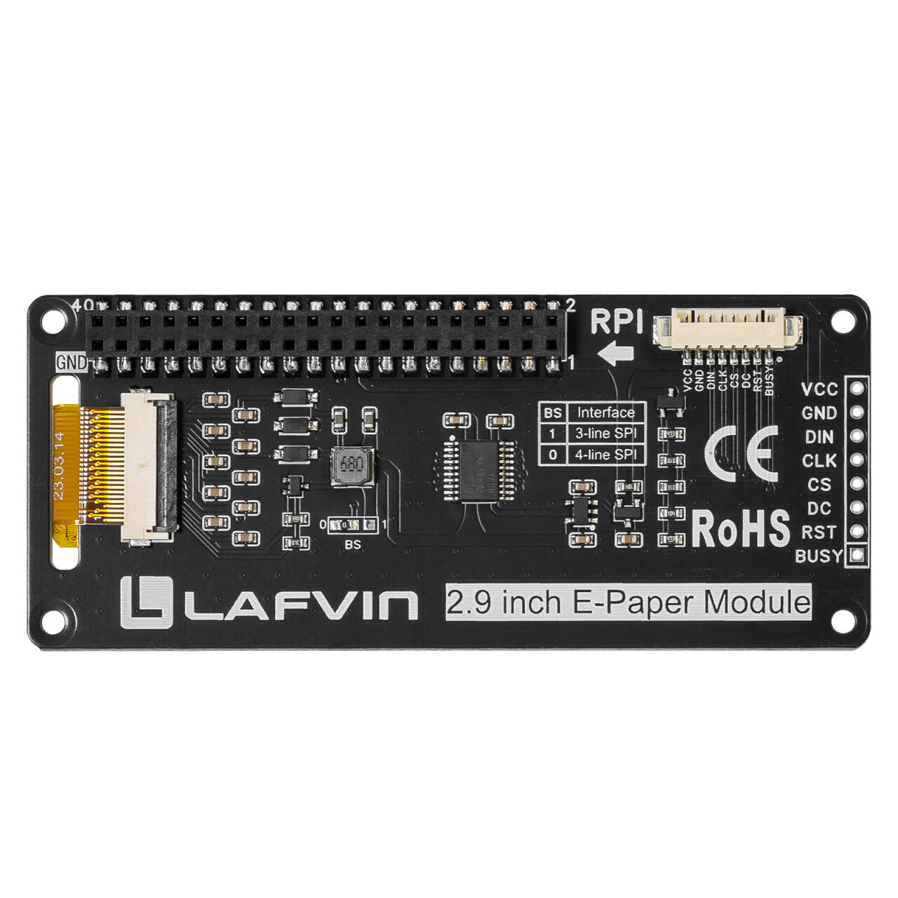
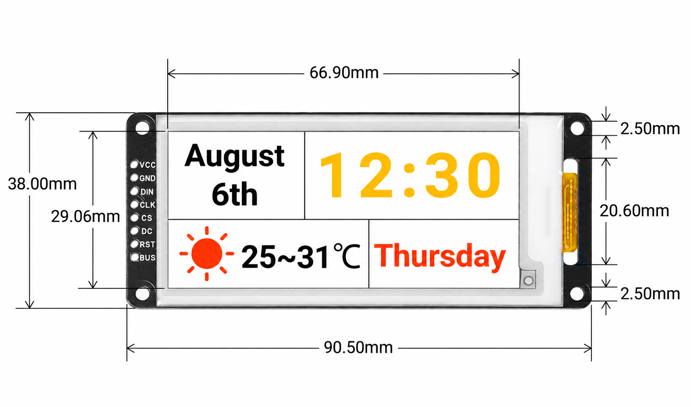
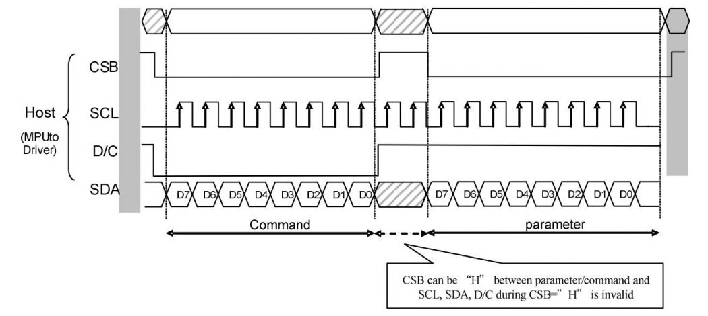

.. _about_this_kit:

About This Kit
==============

LAFVIN 2.9 inch E-paper Module
------------------------------

Introduction
------------

The LAFVIN 2.9 inch E-paper Module is a 2.9-inch E-Ink display module with a
Raspberry Pi 40-pin GPIO extension header, compatible with Raspberry Pi series
boards. It uses a 128 x 296 four-colour display (black, white, red, and
yellow) and uses SPI communication.

No backlight, keeps displaying last content for a long time even when power down.
Ultra low power consumption, basically power is only required for refreshing.

SPI interface, for connecting with controller boards like Arduino/ESP32, etc.
Onboard voltage translator, compatible with 3.3V / 5V MCUs.

Comes with online development resources and documentation, including pin
definitions and Raspberry Pi examples.

Parameters
----------

.. list-table::
   :header-rows: 1
   :widths: 40 60
   :class: longtable

   * - Parameter
     - Specification
   * - Model
     - GDEY029F52
   * - Screen size
     - 2.9 inch
   * - Module footprint
     - 90.5 x 38 mm
   * - Display dimensions
     - 29.056 mm x 66.896 mm
   * - Operating voltage
     - 3.3V/5V (5V is required for power supply and signal)
   * - Communication interface
     - SPI
   * - Resolution
     - 128 x 296
   * - Display colour
     - Black, white, red, yellow
   * - Refresh time
     - Full: 26 s; fast: 11 s, at 25 deg C
   * - Operating temperature
     - 0 to 40 deg C
   * - Storage temperature
     - -25 to 70 deg C

Communication Protocol
----------------------

Note: For specific information about SPI communication, you can search for information online on your own.

Working Principle
-----------------

The e-paper used in this product uses "microcapsule electrophoresis display" technology for image display. The basic principle is that charged nanoparticles suspended in a liquid migrate under the action of an electric field. The e-paper display screen displays patterns by reflecting ambient light and does not require a backlight. Under ambient light, the e-paper display screen is clearly visible, with a viewing angle of almost 180 degrees. Therefore, e-paper displays are ideal for reading.

Precautions
-----------

.. role:: red
   :class: red

1. :red:`Partial Refresh Limitation: For e-Paper displays that support partial refresh, please note that you cannot refresh them with the partial refresh mode all the time. After refreshing partially several times, you need to fully refresh EPD once. Otherwise, the display effect will be abnormal, which cannot be repaired!`

2. :red:`Power Management: Note that the screen cannot be powered on for a long time. When the screen is not refreshed, please set the screen to sleep mode or power off it. Otherwise, the screen will remain in a high voltage state for a long time, which will damage the e-Paper and cannot be repaired!`

3. :red:`Refresh Intervals: When using the e-Paper display, it is recommended that the refresh interval is at least 180s, and refresh at least once every 24 hours. If the e-Paper is not used for a long time, you should use the program to clear the screen before storing it. (Refer to the datasheet for specific storage environment requirements.)`

4. **Sleep Mode**: After the screen enters sleep mode, the sent image data will be ignored, and it can be refreshed normally only after initializing again.
      
5. **Image Display Issues**: If you find that the created image data is displayed incorrectly on the screen, it is recommended to check whether the image size setting is correct, change the width and height settings of the image and try again.
      
6. :red:`Cable Handling: The FPC cable of the screen is fragile, Please note: Do not bend the cable along the vertical direction of the screen to avoid tearing the cable; Do not repeatedly excessive bending line to avoid line fracture; Do not bend the cable toward the front of the screen to prevent the cable from being disconnected from the panel. It is recommended to use after fixing the cable during debugging and development.`

7. :red:`Screen Fragility: The screen of e-Paper is relatively fragile, please try to avoid dropping, bumping and pressing hard.`

8. **Testing Recommendation**: We recommend that customers use the sample program provided by us to test with the corresponding development board.

9. **Interface Selection**: Do not use different module interfaces at the same time.

.. raw:: html

   
